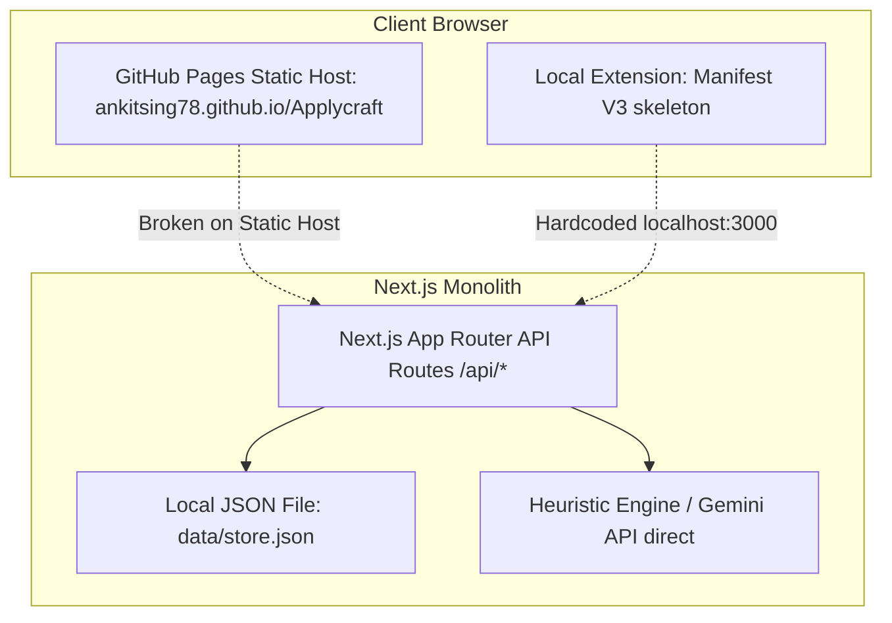

# Current Architecture — ApplyCraft AI

## Existing Architecture Components

### 1. Frontend
- Next.js 14 App Router, React 18, Tailwind CSS, Lucide icons.
- Pages: `/`, `/profile`, `/portals`, `/apply`, `/review`, `/tracker`, `/extension-guide`.
- Problem: Frontend makes relative calls (`/api/...`) assuming a monolithic server. On GitHub Pages, Next.js API routes are non-functional static files.

### 2. Backend & Data Layer
- Next.js Route Handlers (`src/app/api/...`).
- Synchronous filesystem read/write (`fs.readFileSync`, `fs.writeFileSync`) to `data/store.json`.
- Single tenant, no authentication, no authorization, no row-level security.

### 3. AI & Tailoring
- Basic Gemini 1.5 Flash client fallback to hard-coded text replacements.
- No schema validation (Zod).
- No candidate fact evidence graph.
- Hardcoded ATS match formulas.

### 4. Browser Extension
- Manifest V3 with basic permissions (`activeTab`, `storage`, `scripting`).
- Injects a naive `querySelectorAll` content script.
- Hardcoded to ping `http://localhost:3000`.
- No ATS-specific adapters.
- No CAPTCHA/MFA pause detection.
- No submission verification.
