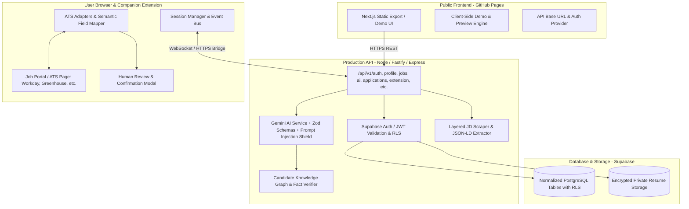

# Target Production Architecture — ApplyCraft AI

## Core Architectural Pillars

### 1. Decoupled Static Frontend + Headless Backend
- **Public URL**: `https://ankitsing78.github.io/Applycraft/` serves the static Next.js frontend.
- **Backend API**: Configurable `NEXT_PUBLIC_API_BASE_URL` pointing to the Node.js production service.
- **Demo Mode**: If disconnected from the live backend, the frontend clearly displays `[DEMO MODE]` and uses fixture data, never pretending to have submitted real applications.

### 2. Candidate Evidence Engine (Zero Hallucinations)
- Structured knowledge graph mapping every verified candidate fact (`evidenceId`).
- Gemini AI prompts enforce:
  1. Job Description is strictly **untrusted data**, not instructions (Prompt Injection Shield).
  2. Every resume statement must cite its supporting `evidenceId`.
  3. Strict Zod schema validation on model outputs with constrained retries.

### 3. Dedicated ATS Adapter Registry
- Interface `ATSAdapter`:
  - `matchesPage(): boolean`
  - `inspect(): Promise<FormModel>`
  - `fill(field, value): Promise<FillResult>` (handling React/Vue native setters)
  - `detectChallenge(): Promise<ChallengeSignal>` (auto-pause for CAPTCHA/2FA)
  - `detectSubmit(): Promise<SubmitSignal>`
  - `detectSuccess(): Promise<SuccessSignal>`
- Dedicated implementations for:
  - Greenhouse (`boards.greenhouse.io`)
  - Lever (`jobs.lever.co`)
  - Workday (`*.myworkdayjobs.com`)
  - LinkedIn Easy Apply
  - Indeed Apply
  - Naukri.com, Hirist.tech, Foundit, Shine
  - Generic ATS fallback

### 4. Deterministic Submission Verification (Zero Fake Confirms)
- No `Math.random()` confirmation IDs.
- Real submission evidence captured from:
  - Navigation change to verified confirmation URL.
  - Presence of employer confirmation header / reference code.
  - Verified receipt payload recorded in `SubmissionEvidence`.
  - State machine: `READY_TO_SUBMIT` -> `SUBMITTING` -> `SUBMISSION_VERIFYING` -> `SUBMITTED` (or `SUBMISSION_UNKNOWN` if unconfirmed).
